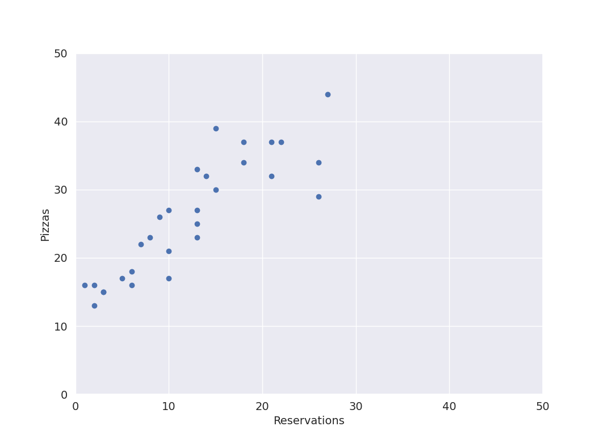
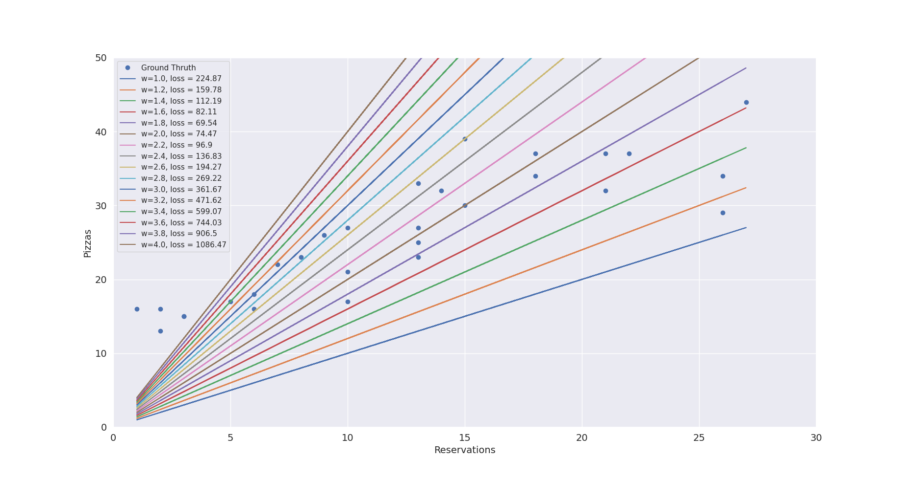
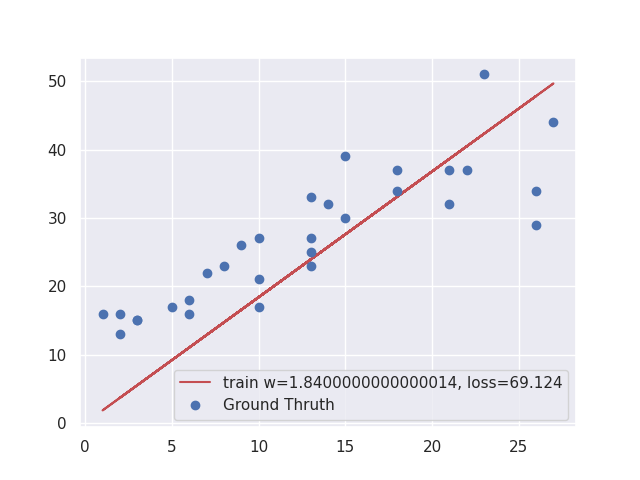
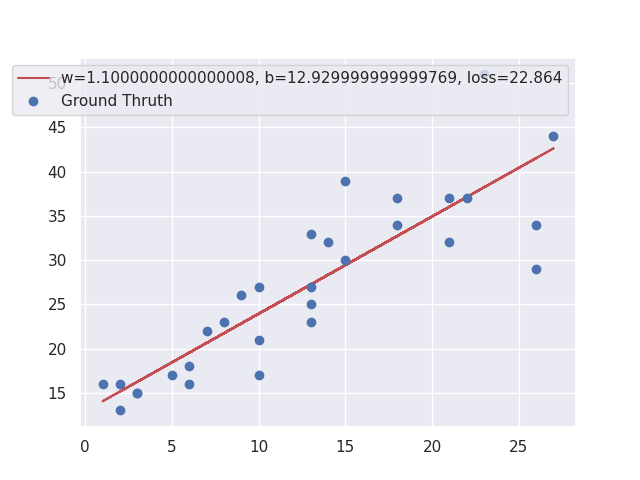

# Simple ML algorithms, which everybody should know

## Supervised pizzas

The file [pizzas list](../datasets/pizzas.txt) contains 30 lines of data.</br> Each is an example, composed of an input variable (the reservations) and a numerical label (the pizzas). Once we have an algorithm, we can use these examples to train it.

```python 0_supervised_pizzas.py```



From the picture we can see that more reservations: more pizzas.

## Linear regression model no bias

$\hat{y} = x\times w$ - this is a prediction values

$\hat{y} =!\ y\ $, y is a ground thruth.

## Training

Given a bunch of examples ($X$ and $Y$), it finds a line with weight $w$ that approximates them. 



for 1000 iteration and lr=0.001



## Linear regression model with bias

```python 1_supervised_pizzas.py```

$\hat{y} = x\times w + b$



## Gradient Descent

GD is a way to find the minimum of the loss function, but it’s faster, more precise, and more general. 