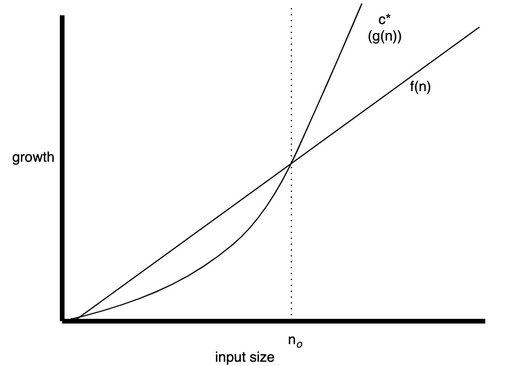

## Сложность алгоритмов

Общие вопросы сложности различных структур данных. 
Сложность алгоритма может быть выражена в в виде полинома. ОДнако часто бывает сложно оценить сложность и время выполнения. Это всегда состязание в том что вносит большую сложность - размер входных данных или сам алгоритм.


### Асимптотический анализ - метод описания предельного поведения функций
(Асимптота - некая кривая с бесконечной ветвью)
- Предположим размер входных данных небольшой (We worry about **large input sizes** only)
- Асимптотический анализ сравнивает две функции **g(n)** и **f(n)** для больших значений **n**.


-  Для очень больших значений **n**, **f(n)** будет находиться не более чем в пределах постоянного коэффициента **g(n)**. 
**f(n)** будет расти не быстрее, чем константа, кратная **g(n)**.

Сложность описывается как f(n)~ O(g(n))


Упрощенно: Если мы имеем функцию типа:
- $n^2 + 2n +1$ -> Сложность $O(n^2)$, 
(if **n** $\rightarrow$ $\infty$  слагаемое $2n << n^2$, поэтому $f(n) $~$ n^2$)
- $n^5 + 4n^3 +2n$ -> Сложность $O(n^5)$
- $3n^3 + 4n +2$ -> Сложность $O(n^3)$
- $e^{3n} $ -> Сложность $O(e^{n})$ 

Отбрасываются константы, оставляем только самый старший член уравнения. 

**ВАЖНО**:
Если предположить, что есть алгоритм A $O(n)$ и  алгоритм B $O(n^2)$, Для больших значений **n** алгоритм B будет медленнее **A**, но не всегда.

### Упрощенный Асимптотический анализ

Когда получили сложность алгоритма путем подсчета количества примитивных операций, получаем **O**:
- Отбрасываем мультипликативные константы от всех членов уравнения
- Отбрасываем все кроме члена высокого порядка

### Big $\Omega(.)$
- **O(n)** характеризует время работы алгоритма в наихудшем случае.
- $\Omega$ характеризует время работы алгоритма в наилучшем случае.
- $n^{3} $ -> Сложность $\Omega(1)$ 

### Big $\Theta(.)$
- $\Theta$ характеризует время работы алгоритма в текущем значении.
- $n^{2} $  $\in$ $O(n^{3})$, but $\notin$ $\Omega(n^{3})$


### Big $O(.)$ is better to use

####Complexity examples
- Лист или массив имеет сложность **c * len() = O(n)**
- Если есть некий алгоритм, когда количество елементов каждый раз уменьшается вдвое, то скорре всего **O(log n)** 

- Цикл по массиву **n = O(n)**
```
for x in range(n):
    pass
# range - возвращает массив от 0 до n-1

```
- Loop with increments  $floor(n/k)=O(n), k << n$
```
for x in range(1, n, k):
    pass
```
- Simple nested for loop $n*m = O(nm)$
```
for x in range(1, n):
    for y in range(1, m):
```
- Nested for loop with dependant variables $O(n^2)$
```
for i in range(n):
    for x in range(i):
```
- Цикл с логарифмической сложностью $n*m = O(log_k (n))$
```
i = 1
n = 16
k = 2
while i < n:
    i*=k
    # Statement(s) that take(s) constant time
```
- 
**Example complexity**
```
n = 10                          # step 1
sum = 0                         # step 1                           
pie = 3.14                      # step 1
for var in range(1, n, 3):      # step n/3 range генерирует лист до цикла
                                # sep n/3 Each time, `var` is initialized to an element of the list generated by `range()`
    print(pie)                  # step n/3 печать выполняется n/3 times
    for j in range(1, n, 2):    # step n/2
                                # step n/2
        sum += 1                #step n
        print(sum)               #step n/2

```
**1+1+1+n/3+n/3+n/3 (n/2 + n/2 + n + n/2) = 3+4n/3*5n/2 ~n*n**
**Example complexity**
```
n = 10                          # 1
sum = 0                         # 1
pie = 3.14                      # 1
for var in range(n, 1, -3):     # n/3 - range
                                # n/3 - var
    print(pie)                  # n/3
    for j in range(n, 0, -1):   # inner n - range
                                # inner n -j
        sum += 1                # inner 2n (adding of 1 and assigning that value to variable sum is 2 n)
print(sum)                      # 1
```
**1 + 1 +1 + (n/3 + n/3 + n/3) *(n+n+2n) = 3+n*4n ~ O(n^2)**
**Example complexity**
```
n = 10                          # 1
sum = 0                         # 1
pie = 3.14                      # 1
var = 1                         # 1
while var < n:                  
    print(pie)                  # log2(n)
    for j in range(var):        # double var  
        sum += 1
    var *= 2                    # 1 =2^0, 2 = 2^1, 4 = 2^2, 8 = 2^3, 16 = 2^4 - log2(n)
print(sum)
```