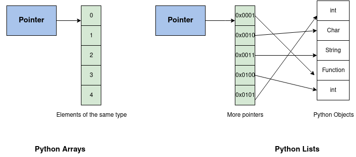

##Структуры данных

### List -ordered sequence with different datatype 
 Лист - структура данных для хранения объектов различных типов:
- Имеет индекс
- Может хранить объекты разных типов
- Содержит ссылку на структуру памяти, которая хранит ссылки на другие объекты
```
example_list = [3.14159, 'apple', 23]  # Create a list of elements
empty_list = []                        # Create an empty list
sequence_list = list(range(10))        # Create a list of first 10 whole numbers

another_list = [a_list, 'Python', foo, ['yet another list']]  Элементом листа может быть функция
print(another_list[0])                  # Elements of 'aList'
print(another_list[0][1])               # Second element of 'aList'
print(another_list[1])                  # 'Python'
print(another_list[3])                  # 'yet another list'
another_list[2]()  # 'Hello from foo()!'

```
###Методы Листа

- **append** - Добавляет элемент в конец листа **O(1)**
- **insert(элемент, позиция)** - Вставляет элемент в лист **O(n)**
```
list = [1, 3, 5, 'seven']
list.insert(0, 2)
[2, 1, 3, 5, 'seven']
```
- **remove(элемент)** - Убирает элемент их листа **O(n)**, если элемента нет, выдает runtime error
```
list.remove('seven')
[2, 1, 3, 5]
```
- **pop(индекс)** - Убирает элемент по  индексу или просто последний
```
list = [1, 3, 5, 'seven']
list.pop()
[1, 3, 5]
list.pop(1)
[1, 3]
```
- **reverse()** reverse the list **O(n)**
```
list = [1, 3, 5, 'seven']
list.reverse()
['seven', 5, 3, 1]
lst_revers = lst[::-1]
[1, 3, 5, 'seven']
```
###Slicing
```
list = [0, 1, 2, 3, 4, 5, 6, 7, 8, 9]
list[end:start]
list[0:5]
[0, 1, 2, 3, 4]     % 1st of 5 elements
list[5:]
[4, 5, 6, 7, 8, 9]
list[::2]
[0,  2,  4,  6,  8]
list[2:8:2]
[2, 4, 6]
list = list(range(10))
print(list[3:])                          # 3, 4, 5, 6, 7, 8, 9
print(list[:3])                          # 0 1 2
print(list[:])                          # 0, 1, 2, 3, 4, 5, 6, 7, 8, 9
list[start:stop:step]
print(list[0:9:2])  # 0, 2, 4, 6, 8  
print(list[9:0:-2])  # 9, 7, 5, 3, 1
```
-**Инициализация Слайса**
```
list = [i fo i in range(10))]

arr[start:end] = [list, of, New, values]
x = list(range(5))
print(x)  # 0, 1, 2, 3, 4
x[1:4] = [45, 21, 83]
print(x)  # 0, 45, 21, 83, 4
```
-**Deleting elements from the list**
```
list = [i fo i in range(10))]
del list[::2]   # удалить каждый второй
```
-**Negative indexing**
```
list = list(range(10))
print(list[4:-1])  # 4, 5, 6, 7, 8
```
### Массивы - ordered sequence with single datatype
- **Initialize array**
```
import array
new_array = array.array('type', [list])
new_array = array.array('f', [1, 2, 3])
```
- **Array Slicing**
```
initializer_list = [2, 5, 43, 5, 10, 52, 29, 5]
number_array = array.array('i', initializer_list)
print(number_array[1:5])              # 2nd to 5th
print(number_array[:-5])              # beginning to 3rd
print(number_array[5:])               # 6th to end
print(number_array[:])                # beginning to end
```
- **Changing or adding element**
```
integers[0] = 0                       # changing first element
integers[2:5] = array.array('i', [4, 6, 8]) # changing 3rd to 5th element

numbers = array.array('i', [1, 2, 3])
numbers.append(4)                      # add one item to the end of an array
numbers.extend([1, 2, 3])              # add several items to the end of an array
integers = array.array('i')            # creating empty array of integer
i = odd + even                         # concatinating the arrays
```
- **Remove element**
```
del integer_array[2]                    # removing 3rd element from the array
del integer_array                       # removing the array

integer_array = array.array('i', [10, 11, 12, 12, 13])
integer_array.remove(12)                # removing the 1st element that is equal to 12
integer_array.pop(2)                    # remove an item at the given index

```
### Отличие List vs Array



- Array занимает меньше памяти чем List, поэтому более быстрый. 

- List более гибок,  List хранит дополнительно указатель на блок указателей на конкретный тип объекта. 


### Numpy Initialization of an array
```
import numpy as np
numpy_array = np.array([1, 2, 3])
```
