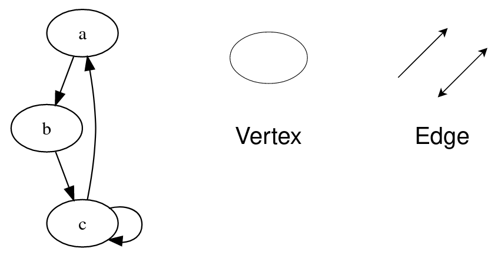

## Графы

Применяются
GPS, neural networks, peer-to-peer networks, search engine crawlers, garbage collection

### Графы - Структура





- **vertex** - вершина
- **edges** - ребра - многонаправленные, однонаправленные
- **Degree of a Vertex** - количество ребер вершины
  - **in-Degree** - входящие в граф
  - **out-Degree** - исходящие из графа
- **Parallel Edges** - ребра исходящие и входящие в один vertex
- **Self Loop** - ребро начинает и входит из одного вертекса
- **Adjacency** - связб межлу соседними вершинами

### Графы - Типы

1. Undirected Graph
2. Directed Graph

```
class mySteck:
    def __init__(self):
        self.stack_list = []

stack_obj = mySteck()
```

### Queue - First in First Out первый пришел - первый ушел

- **endqueue(element)** - вставить элемент в конец очереди
- **dequeue()** - вынуть элемент из начала очереди 
- **front()** - возвращает первый элемент
- **rear()** - возвращает послелний элемент 
- **isEmpty()** - если очередь пуста 
- **size()** - возвращает размер очереди

### Типы очереди
1. Линейная очередь
2. Циклическая очередь
Последний элемент это первый элемент 
3. Double-Ended очередь
Начало может быть концом