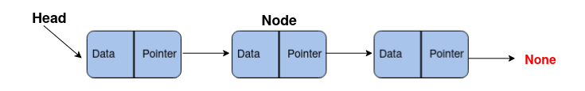

## Singly Linked Lists (SLL) Односвязные списки
SSL:
- Cтруктура данных, состоящая из элементов одного типа **Node**, связанных между собой последовательно посредством указателей **pointers**.
- Последний элемент списка указывает на **NULL**.
- Элемент, на который нет указателя, является первым (**HEAD**) элементом списка.
- Cсылка в каждом узле указывает на следующий**Node**** в списке.
- Передвигаться можно только в сторону конца списка (поэтому он однонаправленный).



1. **Node Class** has two variables
```
class Node:
    def __init__(self, data):
        self.data = data  # Data field
        self.next_element = None  # Pointer to next node
```
2. **Linked List Class** has two variables
```
class LinkedList:
    def __init__(self):
        self.head_node = None  # Pointer to first node
```

## Linked List vs List
Отличие в том, как добавляются и удаляются элементы в лист.
1. Lists вставка и удаление в начало списка происходит за время **O(n)**
    -  списки располошатся в памяти непрерывно
    - Это позволяет индексировать список, операция доступа к элементу списка составляет  **O(1)**
1. LinkedLists вставка и удаление в начало списка происходит за постоянное время **O(1)**, а в конце списка за время **O(n)**
    -  связанные списки рассредоточены в памяти 
    - Для доступа к элементу списка нужно пройти по списку **O(n)**
## Основные операции со связанным списком
Получить доступ к первому элементу списка **O(1)**
```
    get_head() - returns the head of the list 
```
Проверить если список пустой **O(1)**
``` 
    is_empty() - returns true if the linked list is empty
``` 
Вставить новый элемент в начало списка **O(1)**
```
    insert_at_head(data) - inserts an element at the start/head of the linked list
``` 
Вставить новый элемент в конец списка **O(n)**
```
    insert_at_tail(data) - inserts an element at the end of the linked list
```
Поиск элемента по списку **O(n)**
``` 
def search(lst, value):
    # Start from first element
    current_node = lst.get_head()
    # Traverse the list till you reach end
    while current_node:
        if current_node.data == value:
            return True  # value found
        current_node = current_node.next_element
    return False  # value not found
``` 
Удалить первый элемент из списка **O(1)**
``` 
def delete_at_head(lst):
    # Get Head and firstElement of List
    first_element = lst.get_head()

    # if List is not empty then link head to the
    # nextElement of firstElement.
    if first_element is not None:
        lst.head_node = first_element.next_element
        first_element.next_element = None
    return

``` 
Удалить элемент из списка по значению **O(т)**
``` 
    delete_at_head() - deletes the first element of the list
``` 


