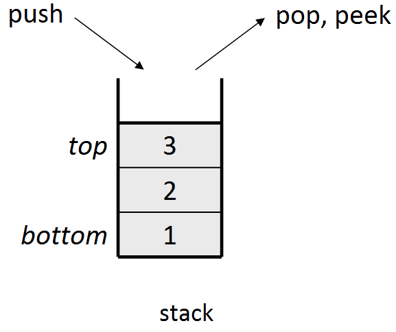

## Stack and Queue

### Stack - Last in First Out первый пришел - последний ушел




- **push(element)** - вставить элемент в стек в **top**
- **pop()** - вынуть элемент с **top** и возвратить
- **peek()** - возвращает элемент с **top** 
- **isEmpty()** - если стек пустой - возвращает 1
- **size()** - возвращает размер стека
### Как создать Stack
1. Стек с использованием **Lists**

```
class mySteck:
    def __init__(self):
        self.stack_list = []

stack_obj = mySteck()
```

### Queue - First in First Out первый пришел - первый ушел

- **endqueue(element)** - вставить элемент в конец очереди
- **dequeue()** - вынуть элемент из начала очереди 
- **front()** - возвращает первый элемент
- **rear()** - возвращает послелний элемент 
- **isEmpty()** - если очередь пуста 
- **size()** - возвращает размер очереди

### Типы очереди
1. Линейная очередь
2. Циклическая очередь
Последний элемент это первый элемент 
3. Double-Ended очередь
Начало может быть концом